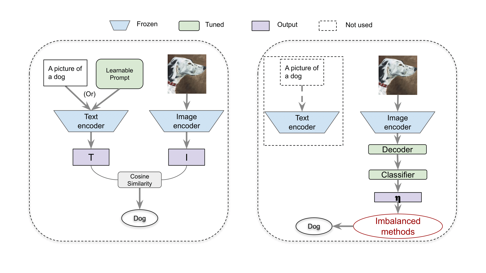

# Exploring Vision-Language Models for Imbalanced Learning
Code and experimental logs for [Exploring Vision-Language Models for Imbalanced Learning](https://arxiv.org/abs/2304.01457).



## Requirements

The code is based on [USB](https://github.com/microsoft/Semi-supervised-learning).

+ Python 3.10
+ PyTorch 2.0
+ CUDA 11.8

To reproduce our results, you can create our exact same conda environment with:
```shell
conda env create -f environment.yml
```

## Datasets
+ Imagenet_LT: Download ILSVRC2012_img_train.tar & ILSVRC2012_img_val.tar from https://image-net.org/index and extract with https://github.com/pytorch/examples/blob/main/imagenet/extract_ILSVRC.sh.
+ Places: Download places365standard_easyformat.tar from http://places2.csail.mit.edu/download.html and extract.
+ iNaturalist: Download iNaturalist18_train_val2018.tar.gz from https://github.com/visipedia/inat_comp/tree/master/2018 and extract.


## Training

Modify paths to your datasets at `scripts/config_generator_imb_clip.py` L237 and generate config files:
```shell
cd Imbalance-VLM && mkdir logs && mkdir config
python3 scripts/config_generator_imb_clip.py
```
Then you can run experiments with commands like:
```shell
python3 train.py --c ./config/imb_clip_stage1_algs/supervised/imagenet_lt_softmax_None_None_0.yaml
```
You could also run all commands required to reproduce results generated by `scripts/config_generator_imb_clip.py` in `all_commands.txt` with https://github.com/ExpectationMax/simple_gpu_scheduler.


## Experiment Results

The logs of training can be found at [Internet Archive](https://archive.org/details/imbalance_lvm_logs_backup).
All our experiment data (including debug runs) were uploaded to wandb, please refer to our wandb projects: [Imagenet_LT](https://wandb.ai/imbclip/imagenet_lt), [iNaturalist](https://wandb.ai/imbclip/inaturalist) and [Places](https://wandb.ai/imbclip/places).

## Cite US
```bibtex
@article{wang2023exploring,
  title={Exploring Vision-Language Models for Imbalanced Learning},
  author={Wang, Yidong and Yu, Zhuohao and Wang, Jindong and Heng, Qiang and Chen, Hao and Ye, Wei and Xie, Rui and Xie, Xing and Zhang, Shikun},
  journal={arXiv preprint},
  year={2023}
}
```

